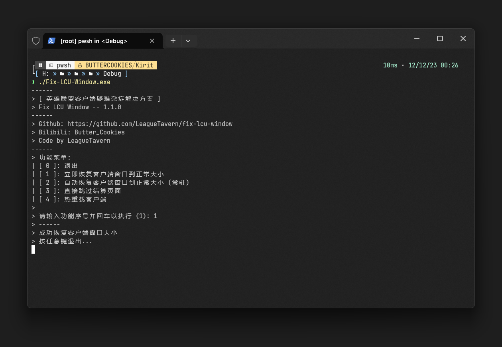

# Fix-League-Client-Update-Window
英雄联盟客户端疑难杂症解决方案。[视频演示](https://www.bilibili.com/video/BV1Cw41147iS/)

## 📝功能
- [x] 修复客户端窗口大小异常 (可自动检测)
- [x] 跳过正在转圈的结算页面
- [x] 热重载客户端 (不会触发排队)

## 👋注意
- **本工具从实现原理上没有封号的可能**。
- 本工具依赖 `.NET Framework 4.8` (`Windows 10` 以上一般自带)

## 🚀如何使用
1. 从[这里](https://github.com/LeagueTavern/fix-lcu-window/releases)下载最新版本。
2. 解压到任意目录下，桌面也好，总之你方便找到就行。
3. 启动`Fix-LCU-Window.exe`，**程序可能会申请管理员权限，请务必点 [是] ，否则程序将无法运行**。
4. 输入你想要执行的功能序号，按回车键执行。

## 😡为什么我会做这个工具
- 有很多人说，将游戏设置成 `DX9` 问题即可解决窗口大小异常的问题，但我个人并不喜欢 `DX9` 模式 ，首先就是帧数低，差了**100帧**左右，其次就是切屏有黑屏时间，我本人电脑的配置较差，这些问题都是我不能忍受的，**所以请不要在B站视频评论、Issues、Pull requests里面刷一些本工具无用的言论，这个工具最初是我自己做给自己用的， `DX11` 模式下出现各种各样的专属BUG本身就是游戏发行商的问题，请不要在这方面洗，我会觉得很恶心。**
- 本人无边框掉帧严重。
- 在客户端里使用 `Ctrl`+`↑`/`↓` 或许可以为你解决异常的问题，但此方法对我无效，所以我才做了这个工具。
- 在客户端设置里，选择 `游戏时关闭客户端` 可以解决问题，但是对我渣机而言加载时间过长，而且这种模式在游戏里是拿不到 `LCUAPI` 的 `port` 与 `token` 的(中国大陆服务器已禁用`lockfile`生成)，如果关闭此选项，那我每次调试代码时都要关闭游戏，拿参数，然后再进入一遍游戏。
- 为了防止频繁切屏导致客户端异常，我也尝试过减少切屏次数，比如[将重生时间同步到代码编辑器](https://github.com/Coooookies/vscode-league-respawn-timer)，这样就不需要来回看了。

## 实现原理
1. 修复客户端窗口大小异常
    - 获取目标窗口HWND
    - 获取屏幕大小
    - 触发窗口DPI变更事件
    - 通过LCUAPI获取客户端缩放比，并根据比例对窗口尺寸进行计算
    - 设置窗口与CEF渲染区域的大小
2. 跳过正在转圈的结算页面
    - 基于LCUAPI实现
3. 热重载客户端
    - 基于LCUAPI实现

## 协议
本项目遵循[MIT](https://github.com/LeagueTavern/fix-lcu-window/blob/master/LICENSE.txt)